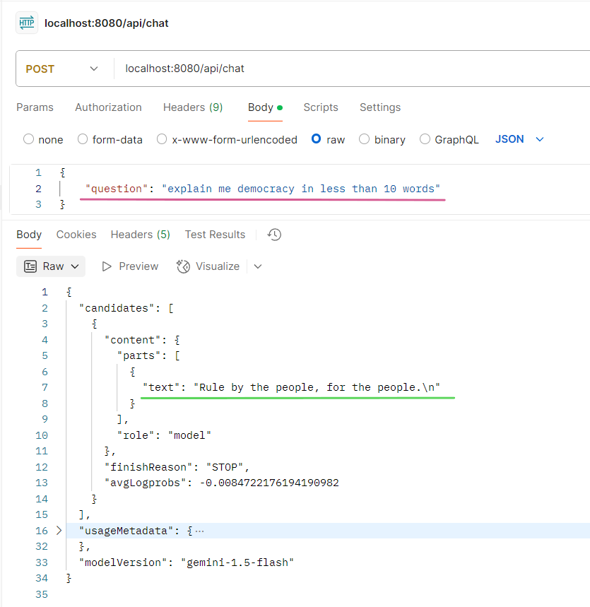
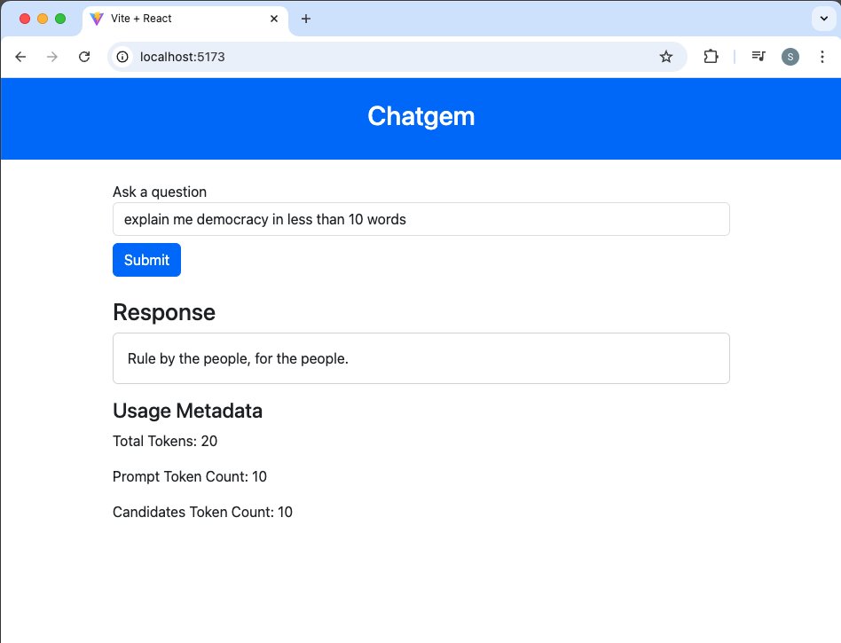

# Gemini Chat Application Using Spring Boot

This sample applicaiton uses spring boot and react frontend (todo) to talk to google model 'Gemini 1.5 glash' to get answers for questions provided.

### Environment vairable must be set before running
- GEMINI_API_URL (refer: [this](https://ai.google.dev/gemini-api/docs/api-key#send-gemini-api-request))
- GEMINI_API_KEY (refer: [this](https://aistudio.google.com/app/apikey))
- CHATGEM_UI_URL (usually the react app url: http://localhost:5173)

### Links to documentation

- [Gemini 1.5 Flash](https://ai.google.dev/gemini-api/docs/models/gemini#gemini-1.5-flash)
- [Spring Boot](https://spring.io/blog/2025/02/20/spring-boot-3-4-3-available-now)

### Demo

- 
-  